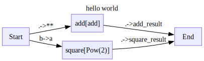

# LADLE


<!-- WARNING: THIS FILE WAS AUTOGENERATED! DO NOT EDIT! -->

> LLM Agent Diagram Language Express (LADLE) is a library for building
> complex LLM Agents easily using [string
> diagrams](https://julesh.com/the-art-of-string-diagrams/).

## Motivation

We found current agentic frameworks unnecessarily complex:

- Too many levels of abstractions and boilerplate code.
- Too many interfaces to learn
- To many wrappers to build for our code to fit these frameworks

As a response, we create `Ladle` which aims to:

- Have a small interface - making it easier to learn.
- None intursive - You can use your own functions in ladle, without
  fitting them to a complex interace.
- Be low in abstractions - we dont create tons of wrappers you have to
  navigate, you bring your own functions.
- Make tracing and debugging simple.

## Installation

``` bash
# in an environment with python>=3.10
pip install git+https://github.com/DeanLight/ladle.git
```

`Ladle` uses [graphviz](https://graphviz.org) to draw your diagrams.
These are automatically rendered in jupyter notebooks. Make sure you
[download and install](https://graphviz.org/download/) graphviz on your
system if you want diagrams to be rendered.

## Usage

``` python
# import the basic building blocks
from ladle.diagrams import V,E,Define
```

``` python
# define your own function
def add(a,b):
    return a+b

# or function-objects
class Pow():
    def __init__(self,power):
        self.power = power
    def __call__(self,a):
        return a**self.power
    def __str__(self):
        return f'Pow({self.power})'
```

``` python
# define your diagram
with Define('hello world',direction='LR') as Schema:
    V('add',add)
    V('square',Pow(2))
    E('Start->add(**=.)')
    E('Start->square(a=b)')
    E('add->End(add_result=.)')
    E('square->End(square_result=.)')
```



``` python
# run the diagram
diagram = Schema()
for trace in diagram.run({'a':1,'b':2}):
    # print/log/etc the traces however you want
    trace.pprint(skip_passthrough=True)
# after running, access the output 
diagram.output
```

    Node add:
    {'input': {'a': 1, 'b': 2}, 'output': 3}
    ================================================================================
    Node square:
    {'input': {'a': 2}, 'output': 4}
    ================================================================================

    {'add_result': 3, 'square_result': 4}

## Reporting Bugs

Found bugs? Missing features? Feel free to [open an
issue](https://github.com/DeanLight/ladle/issues)

## Contributing

Want to contribute to Ladle? Great! Feel free to submit a PR or discuss
a feature you would like to add in the Issues.

To get a working development environment:

``` bash
# clone the repo
git clone https://github.com/DeanLight/ladle.git    
cd ladle

# install ladle in editable dev mode
pip install -e ".[dev]"

# run pre-commit to install commit hooks
pre-commit install
```

`Ladle` is developed using [nbdev](https://nbdev.fast.ai/)

``` bash
# Make changes under nbs/ directory
# ...

# clean and export notebooks into a python library
nbdev_clean && nbdev_export

# make sure tests pass
nbdev_test

# Changing the docs? make sure that they are rendering correctly
nbdev_docs
```
